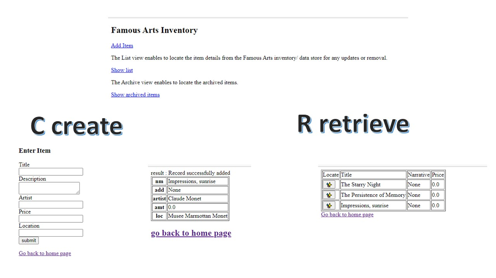
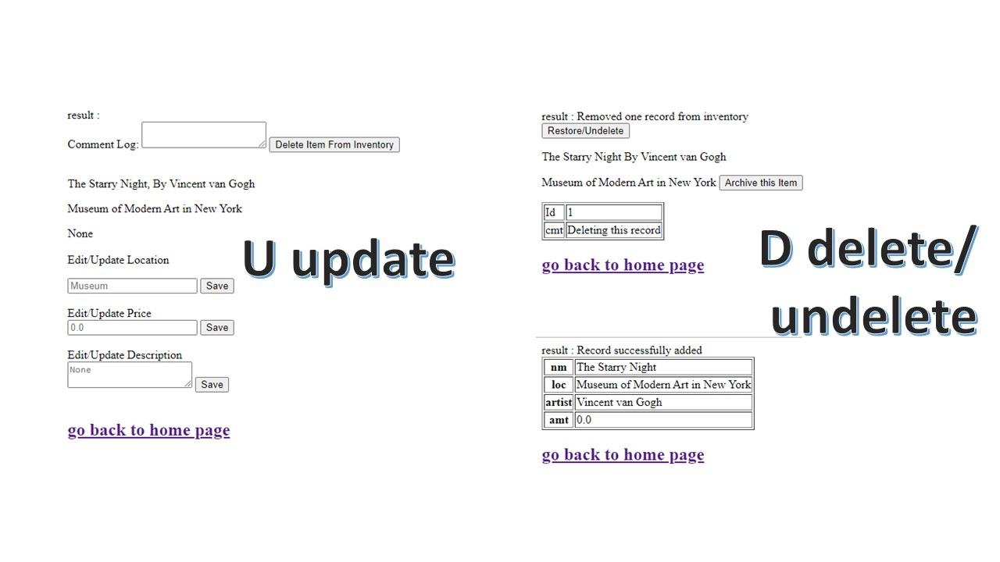
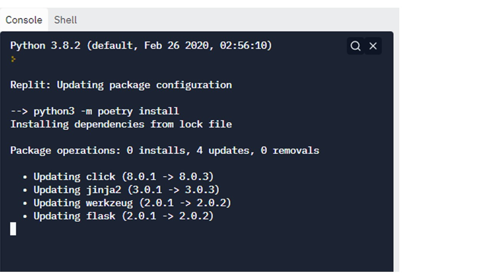
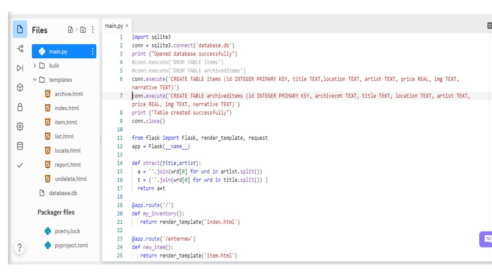

# Web Application
## This application can do Create / Retrieve / Update / Delete functions commonly known as CRUD APIs
# Overview: 
In this project, I created an inventory for the famous art objects in a persistence data store. The API to this data store is a key aspect of how the inventory data is going to be administered/ served. So I have created a few web resources( a mix of html forms, and result html pages) that are bundled together as my web application. The application routing logic, and the handling of parameters that need to be passed amongst these web resources is written in Python language. 

Bulk load could also be performed to the data store for which I have written a python program to load the inventory records from a csv file to the persistent data store.

# Part1- Web Application Demo:
- Web App Entry URL: Index page is the Home page that allows to add items and show list of inventory items as well as any archived items.  Every CRUD function shows the result page after the inserts, or updates made to the item record.
- Additional web pages: Update and Delete to an item is done by first locating the item  Here, I have created the special requirement for deleting the item with comment and option to undelete/ restore or archive the item that was deleted from the inventory using the web application.

CRUD functionality will enable administering the inventory items into a persistence store by allowing the Inserts, Edits, Delete, and View as list 
from the web pages. 

*Note that the web app allows deletion comments when deleting, and undeletion.

  

# Part2- Technology Stack
Using Flask framework for url routes/functions, and using plain HTML and some css for view templates.
The persistence store tables are created using the inbuilt 'SQLite' in python as relational tables and SQL queries are executed from the ptython program. 

## Server Configurations for Build:
I am utilizing the preconfigured environment for python on repl site (https://replit.com/) to demo my application. You will need to create a free account. 

Repl configuration utilizes poetry tool for dependency management and packaging in Python.
<code>[tool.poetry.dependencies] python = "^3.8", Flask = "^2.0.2"
[build-system] requires = ["poetry-core>=1.0.0"] build-backend = "poetry.core.masonry.api"</code>

The only package that the minimal CRUD app is using is Flask framework on Python. 
<code>[[package]]
name = "flask"
version = "2.0.2"
description = "A simple framework for building complex web applications."
category = "main"
optional = false
python-versions = ">=3.6"</code>

Alternatively, in your own python environment, you can use pip installer for Flask framework.

## Web Application Configurations:
- Flask configuration: The application is configured as a minimal crud application so I have not distributed the functionality to different python files.  All of the functionality is in main.py except for the html template pages as they are lengthy enough to be separated. Any styling/css of web page is maintained in the html page itself.
- SQLite configuration: main.py has db connectivity code also available at the start of the page. However, it needs to be run for create tables only one time.  I have also cretaed an option to insert all the sample records provided in BulkLoader/data/locations.csv. A bulkloader.py uses the python code to read the csv file and execute inserts for every item record. Table can be dropped and recreated by uncommenting the appropriate execute statements that are creating the two tables ITEMS and ARCHIVEDITEMS if you no longer want the sample records, and clean up the inserted records.
- Avoid errors: Ensure Databse tables items, archiveditems have been created with specific column names if you are administering the database seaparately, or using Bulkloader functionality to create the table ITEMS.

  
## Future Version: 
I plan to add json narratives, and item images to the data store, as well to the web application.

